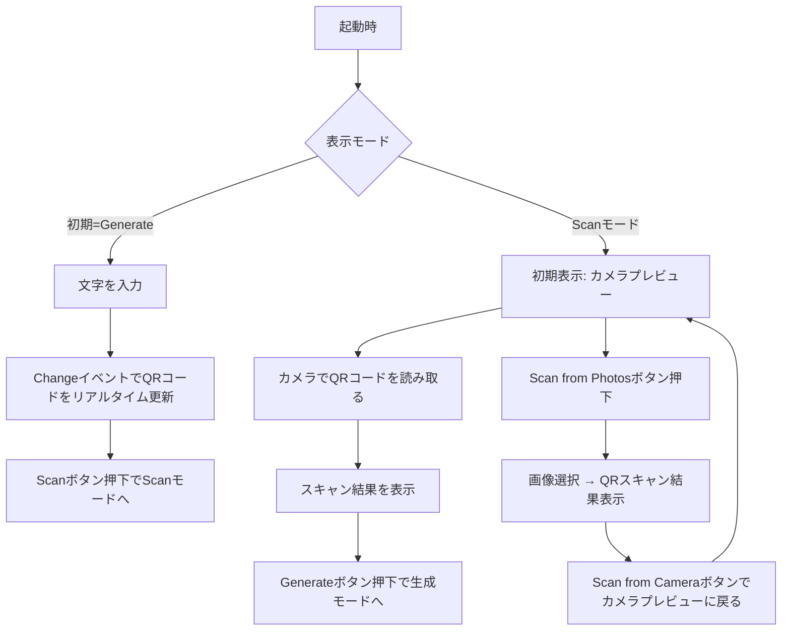

# Step 4 - UI設計まとめ（QRcodelyze）

## 🖼 画面構成

### 🔷 画面1：Generateモード（QRコード生成）

| 位置 | 内容              | 使用Widget                                  |
| -- | --------------- | ----------------------------------------- |
| 上部 | 生成されたQRコードの表示   | `QrImage`（`qr_flutter`）または `Image.memory` |
| 中央 | テキスト入力欄         | `TextField`（リアルタイム更新）                     |
| 下部 | Clearボタン        | `TextButton` or `ElevatedButton`          |
| 下部 | Generateボタン（強調） | `ElevatedButton`（enabled）                 |
| 下部 | Scanボタン（遷移）     | `ElevatedButton`（to Scan画面）               |

### 🔷 画面2：Scanモード（QRコード読み取り）

| 位置 | 内容                          | 使用Widget                          |
| -- | --------------------------- | --------------------------------- |
| 上部 | カメラプレビュー or 選択画像            | `CameraPreview` or `Image.memory` |
| 中央 | スキャン状態/結果表示                 | `Text`, `SelectableText`          |
| 下部 | Scanモードトグル（Camera ⇄ Photos） | `ElevatedButton`（状態に応じて表示を変える）    |
| 下部 | Generateボタン（戻る）             | `ElevatedButton`                  |
| 下部 | Scanボタン（強調）                 | `ElevatedButton`（enabled）         |

---

## 🔁 ユーザー操作フロー

---

## 💡 補足

* Scanモード内で「Scan from Photos」⇄「Scan from Camera」はトグル構造
* Generateモードでは、テキスト変更と同時にQRコードを即時反映（`onChanged` イベント）
* モードごとの状態管理には `StatefulWidget` + `enum ScreenMode { generate, scan }` などを用いる想定
